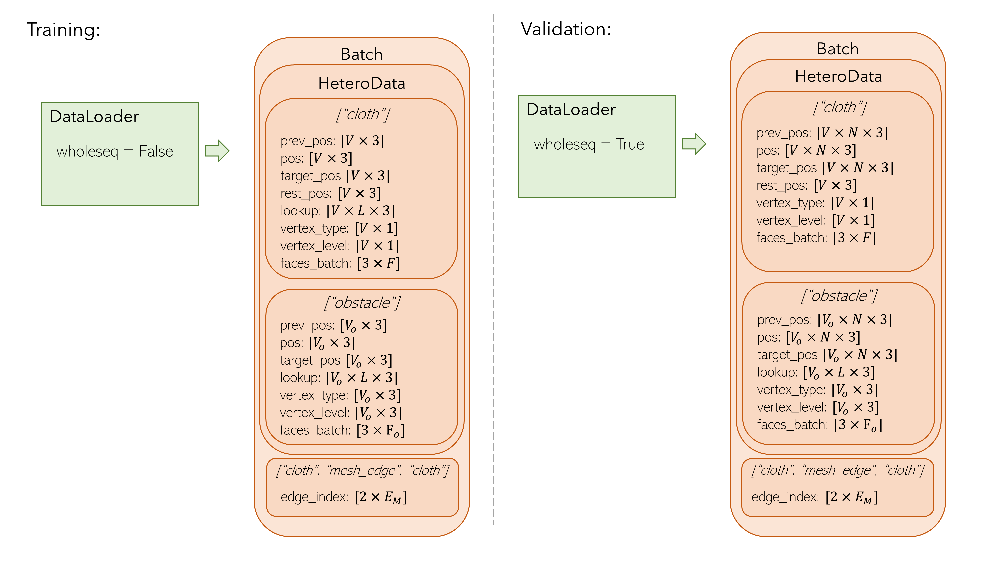

# Data Handling

We store the data for each training sample or a validation sequence
in [HeteroData](https://pytorch-geometric.readthedocs.io/en/latest/generated/torch_geometric.data.HeteroData.html)
object
wrapped in
a [Batch](https://pytorch-geometric.readthedocs.io/en/latest/generated/torch_geometric.data.Batch.html#torch_geometric.data.Batch)
object from pytorch geometric library.

## Nodes of the graph

Each sample has two sets of nodes: `"cloth"` for garment nodes and `"obstacle"` for body nodes.

Each of this node types is a dictionary inside the `Batch` object that stores all the data for this node type (see
picture below).
This data can be accessed with `sample[NODE_TYPE]` where NODE_TYPE is either `"cloth"` or `"obstacle"`.

## Edges of the graph

The Batch object also stores data for the edges of the graph which can be accessed
with `sample[SOURCE_NODES, EDGE_TYPE, TARGET_NODES]`.

The batch built by the dataset only has a set of *mesh edges* (extracted from the garment mesh) accessed by
`sample["cloth", "mesh_edge", "cloth"]` and several sets of coarse edges (`sample["cloth", "coarse_edgeX", "cloth"]`).

During the forward pass of the `Model` we also add proximity-based *world edges* (named *body edges* in the paper):
both direct (`sample["cloth", "world_edge", "obstacle"]`) and inverse (`sample["obstacle", "world_edge", "cloth"]`).

## Dataset's `wholeseq` parameter

`wholeseq` parameter of the Dataset, controls whether the dataset returns a whole sequence of body poses (if `True`) or
only a small window of the sequence (if `False`).

* `wholeseq=False` is used for training
* `wholeseq=True` is used for validation and testing

## Batch size

As the HOOD model is locally applied to each node of the input graph, it can be trained with `batch_size=1` (one pose
sequence in a batch).

Because of that, we only use `batch_size=1` in this repository. Larger batch sizes are not supported.
